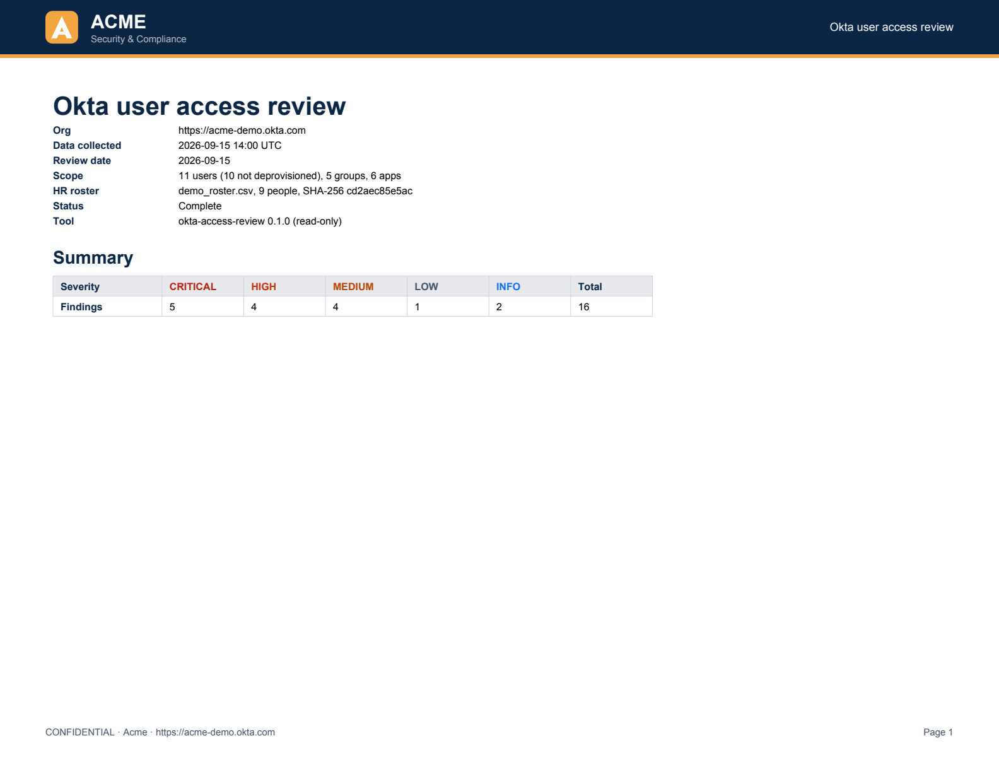
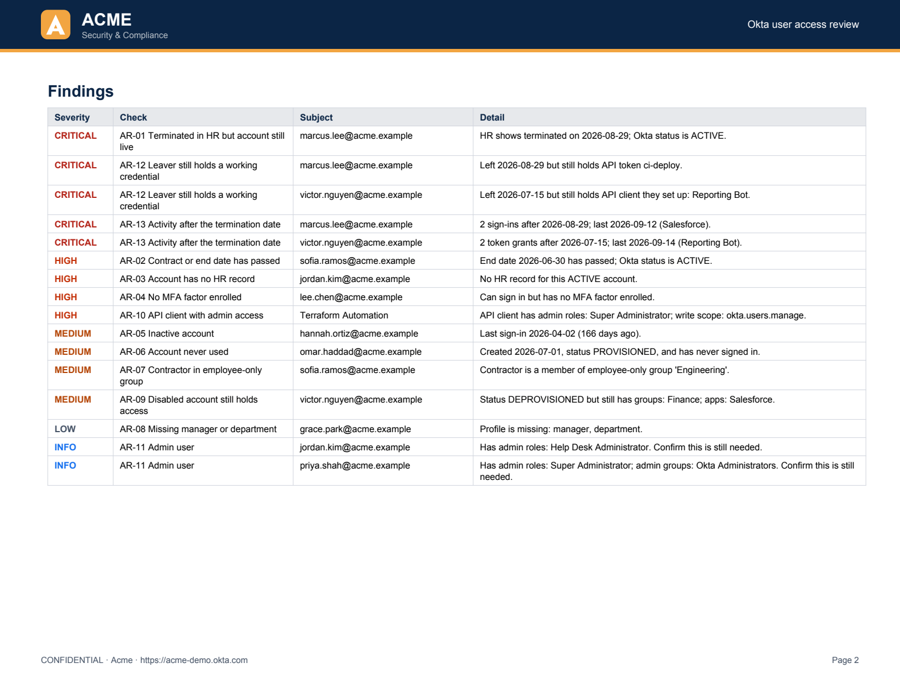

# okta-access-review

A read-only command-line tool that runs a user access review on an Okta org. It compares Okta users,
groups, apps, MFA enrollment and admin roles with an HR roster, flags access to remove or confirm, and
saves the results as evidence for SOC 2 (CC6.1–CC6.3) and ISO 27001:2022 (A.5.15–A.8.5).

- 11 checks, such as terminated users with live accounts, missing MFA, and API clients with write access.
- Read-only scopes, Private Key JWT, and DPoP-bound tokens.
- Output: a PDF with a sign-off page, CSVs, the raw data, and a manifest of SHA-256 hashes.
- The report is marked incomplete if Okta withholds any data.
- Optionally emails the PDF and posts a summary to Slack. Messages contain no personal data.

## Sample report

Every run produces a PDF like this. All data is from **Acme**, a fictional company.



<details>
<summary>Page 2: remediation, control mapping and access by user</summary>



</details>

[Full sample PDF](docs/sample-report.pdf) · The same run posted to Slack:


## Try it without Okta

```bash
uv run access-review \
  --snapshot fixtures/demo_snapshot.json \
  --roster fixtures/demo_roster.csv \
  --config fixtures/demo_config.json \
  --as-of 2026-09-15
```

The demo org has exactly one planted issue for each check, and the tests confirm the review finds
those and nothing else.

## Checks

| ID | Finds | Severity | Controls |
|---|---|---|---|
| AR-01 | Terminated in HR, but the account is still live | critical | SOC 2 CC6.2, CC6.3 · ISO A.5.18 |
| AR-02 | Contract or end date has passed | high | SOC 2 CC6.2 · ISO A.5.18 |
| AR-03 | Account with no HR record (service accounts can be listed) | high | SOC 2 CC6.2 · ISO A.5.16 |
| AR-04 | Can sign in, but has no MFA factor | high | SOC 2 CC6.1 · ISO A.8.5 |
| AR-05 | No sign-in for 90+ days | medium | SOC 2 CC6.2 · ISO A.5.18 |
| AR-06 | Created 14+ days ago and never used | medium | SOC 2 CC6.2 · ISO A.5.16 |
| AR-07 | Contractor in an employee-only group | medium | SOC 2 CC6.3 · ISO A.5.15 |
| AR-08 | Missing manager or department | low | SOC 2 CC6.2 · ISO A.5.16 |
| AR-09 | Suspended or deprovisioned, but still in groups or apps | medium | SOC 2 CC6.2 · ISO A.5.18 |
| AR-10 | Service app with write scopes or an admin role that can make changes (high if Super Administrator) | medium | SOC 2 CC6.3 · ISO A.8.2 |
| AR-11 | Admin user, for the reviewer to confirm | info | SOC 2 CC6.3 · ISO A.8.2 |

AR-01 to AR-03 need the HR roster. Without it they're skipped, and the report says so.
Thresholds and group names are configurable.

## Evidence produced

Each run writes a folder named after its collection time:

| File | For |
|---|---|
| `report.pdf` / `report.md` | Findings with fixes and control mapping, access by user, reviewer sign-off |
| `access_matrix.csv` | Every user's access, with blank `decision` and `reviewer` columns to fill in |
| `findings.csv` | Tracking remediation |
| `snapshot.json` | The exact data the checks ran on |
| `manifest.json` | Config, completeness, and a SHA-256 hash of every file |

`--fail-on high` exits with status 2 when there's a high or critical finding, so a scheduled job or
CI pipeline can alert on it.

## Security design

The tool sees an identity provider with admin-level visibility and writes files full of personal
data. It assumes the laptop, repo or logs could leak, and limits what a leak is worth:

- **Read-only in three places:** Okta grants only `.read` scopes, the CLI refuses any other scope,
  and the client can only send GET requests (a test enforces it).
- **No shared secrets on disk:** Private Key JWT, with every secret fetched from 1Password at run
  time. A secret pasted into the wrong setting is rejected without being printed.
- **Stolen tokens are useless:** DPoP binds each access token to a key that exists only in memory
  for that run.
- **A tested admin-role tradeoff:** only Super Administrator can read admin role assignments. The
  app pairs it with read-only scopes and flags itself for review on every run.
- **Personal data stays in the report:** emails and Slack messages carry only counts, and uploading
  the PDF to Slack is opt-in. Credentials never appear in output or errors.
- **Pinned supply chain:** locked dependencies with a publish-date cutoff.

Details, including the admin-role test results: [docs/security.md](docs/security.md).

## Run it on your org

1. Create an Okta API Services app with read scopes and DPoP
   ([step-by-step](docs/configuration.md#okta-app)), and store its key in 1Password.
2. Run `cp env.example env`, fill it in, and run `git config core.hooksPath .githooks`.
3. Put your HR roster and config in `roster/` (git-ignored), then run:

   ```bash
   ./run.sh --roster roster/hr-roster.csv --config roster/config.json
   ```

Email and Slack are optional: see [docs/notifications.md](docs/notifications.md). All settings,
PDF branding and the roster format are in [docs/configuration.md](docs/configuration.md).

## Limitations

- MFA status comes from enrolled factors. It doesn't check whether a sign-on policy requires MFA.
- Admin roles granted through a group aren't expanded to the group's members yet.
- Apps assigned through several groups are listed once per group.

## Development

```bash
uv run pytest -q
uv run python scripts/render_samples.py   # after changing the PDF layout or demo data
```

The tests cover every check, the Okta client (including DPoP), the PDF, email and Slack, and they
fail if the sample report in this README is out of date.

### Compliance workflow

Every pull request and push to `master` runs the [Compliance workflow](docs/ci.md):

| Check | SOC 2 | ISO 27001 |
|---|---|---|
| Tests, including the demo review | CC8.1 | A.8.29 |
| Secret scan of the full git history (gitleaks) | CC6.1 | A.8.12 |
| Dependency vulnerabilities and lockfile (pip-audit) | CC7.1 | A.8.8 |
| Workflow security lint (zizmor) | CC8.1 | A.8.9 |
| Branch protection on `master` | CC8.1 | A.8.32 |

The results are bundled as evidence with SHA-256 hashes. On `master`, the bundle is signed with a
GitHub artifact attestation. All actions are pinned to commit SHAs, and jobs run with minimal
permissions.

Related: [okta-mcp-local](https://github.com/matt-spellcaster/okta-mcp-local) connects an AI
assistant to Okta for interactive admin work, with the same credential handling.
